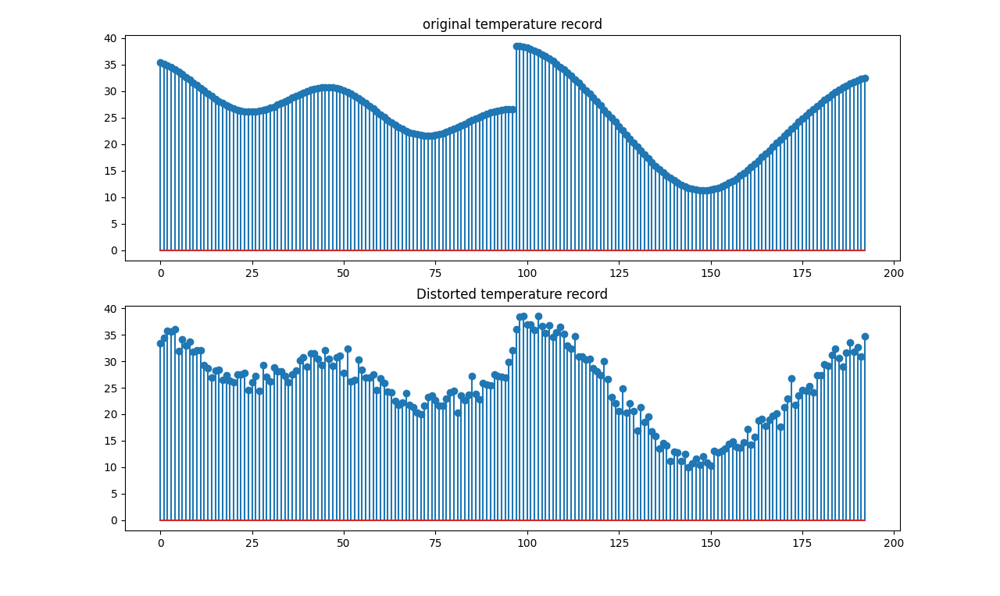

# SNS programming assignment for EE2010 course.
This repository will contain the implementation of the SNS programming assignment.

# Work to be done
* Report
    * Contribution by each member.
    * Plots of signals
    * Theoretical analysis
    * Conclusion
* Code
    * 1D convolution implementation.
    * Denoising
    * Sharpening
    * Fourier Transform implementation(maybe)
    * Producing the two signals
    * plotting the two signals
* README
    * Library dependencies mention
    * Instructions on running the code. 

# Some rough work record
## original vs distorted record graph 

## Denoising with [1/n 1/n ... 1/n] kernel

